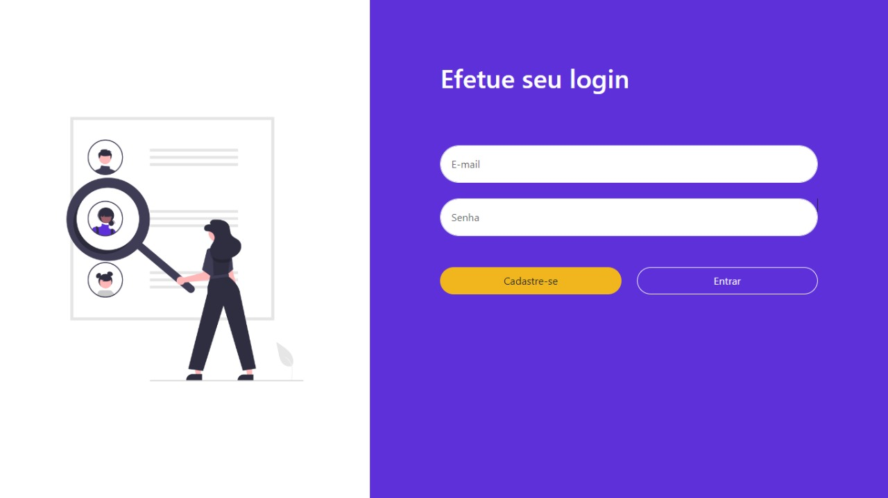
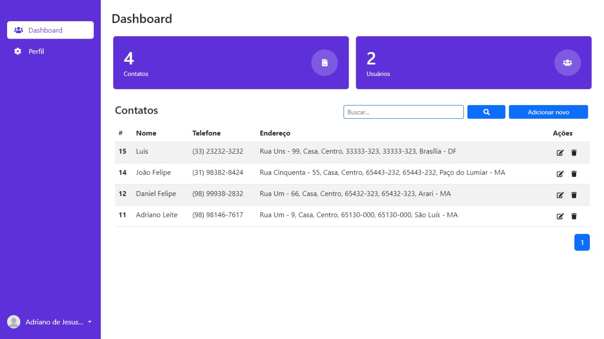
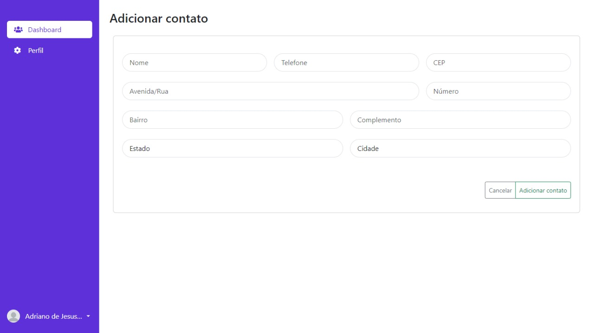
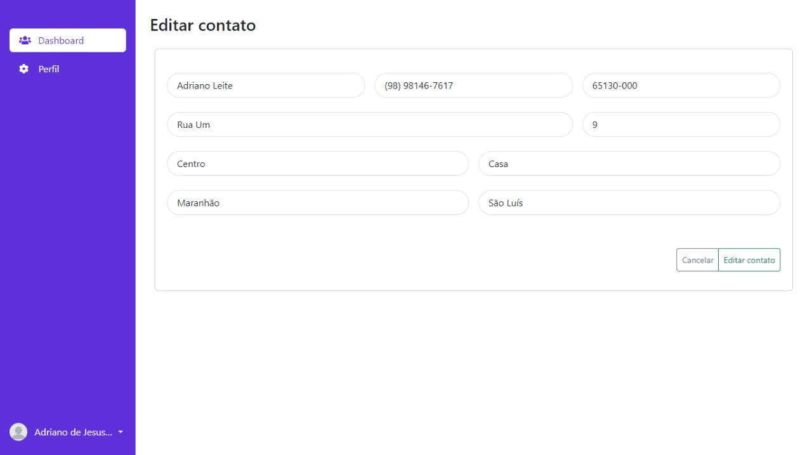
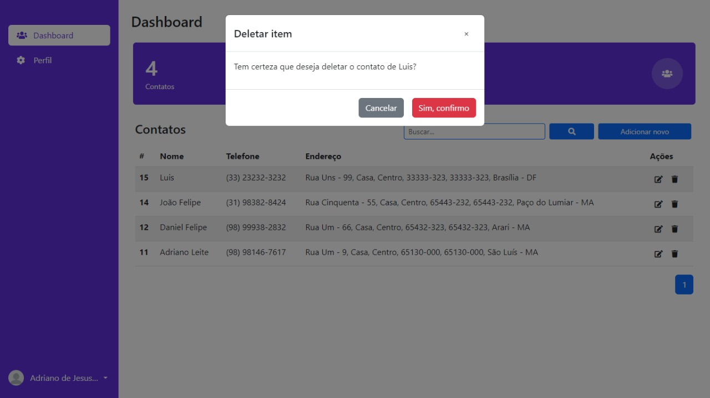
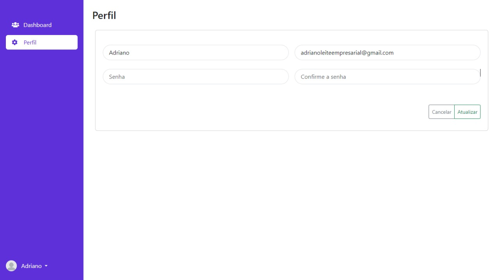

# Agenda Eletrônica
### Esse projeto foi desenvolvido utilizando PHP 8.1 e banco MySQL (.sql se encontra na raiz do projeto)
#### **Agenda Eletrônica** é para você que deseja salvar informações dos clientes como nome, telefone e endereço. Basta criar uma conta gratuita com nome, e-mail e senha e logo após começar a armazenar os seus contatos. Nenhum outro usuário pode ver, editar ou excluir as suas informações.

## Funcionalidades
- Cadastro de usuário
- Login de usuário
- Contagem de usuários
- Contagem de contatos vinculados ao seu usuário
- Listagem de contatos vinculados ao seu usuário
- Paginação de contatos (5 contatos por página)
- Cadastro de contato
- Preenchimento automático de endereço após preencher cep
- Sistema de busca por contato
- Exclusão de contato
- Edição de contato
- Edição de perfil
- Sair do painel
- Aplicação responsiva e adaptada para celular

## Configurações
1. Crie o banco de dados com a estrutura do arquivo "agenda_db.sql" ou importe pelo phpMyAdmin .
2. Configure as variáveis do banco no arquivo classes/Db/DbConnect.php

## Telas

